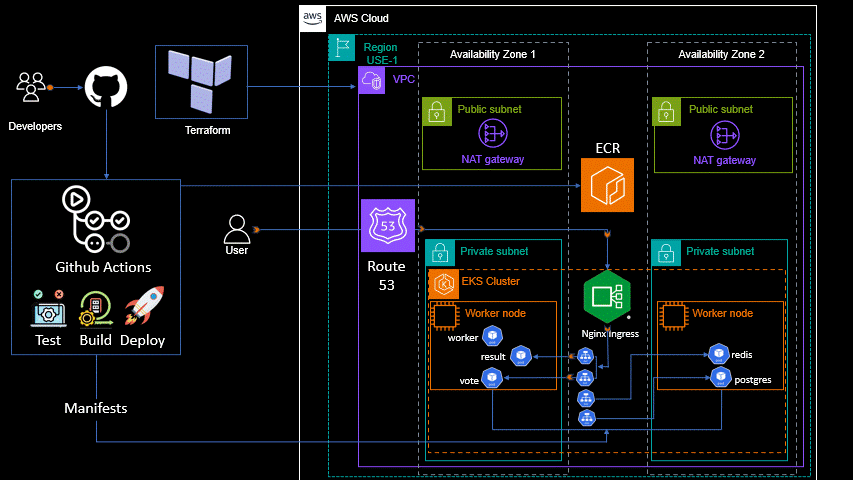

# Example Voting App

A simple distributed application running across multiple Docker containers.

## Architecture

* A front-end web app in [Python](/vote) which lets you vote between two options
* A [Redis](https://hub.docker.com/_/redis/) which collects new votes
* A [.NET](/worker/) worker which consumes votes and stores them in…
* A [Postgres](https://hub.docker.com/_/postgres/) database backed by a Docker volume
* A [Node.js](/result) web app which shows the results of the voting in real time

## Notes

The voting application only accepts one vote per client browser. It does not register additional votes if a vote has already been submitted from a client.

## Solution Technical Architecture

****STEP BY STEP APPROACH ****  --> Medium link below by VIKAS ARORA

**https://awstip.com/step-by-step-guide-to-deploy-dockers-example-voting-app-on-aws-eks-using-github-actions-and-expose-132fdaafb09a**

Follow publication

**Deploy Docker’s Example Voting App on AWS EKS using Github actions and expose it over the internet using Nginx Ingress Controller**
Vikas Arora

Follow
14 min read
·
Aug 11, 2023
10

Working on an end-to-end project was my way of reinforcing the knowledge I gained from the Kubernetes hands-on course that I took last month. At the same time, I wanted to share what I learned.

I wanted to use a microservices-based application for this project to unleash the full potential of Kubernetes. Luckily, I stumbled upon Docker’s example-voting-app when I was going over docker-compose concepts earlier.

The original Docker’s Example Voting App repository helps you to deploy and run the application on your local machine using docker-compose or kubernetes.

I have modified some manifest files and created Github actions (CI/CD) workflows to deploy it on AWS EKS cluster and expose it over the internet.

Application architecture
The architecture shows each component of the application and a brief description of what they do

example-voting-app architecture
voting-app: Front-end of the application, written in python flask framework, which allows the users to cast their votes.
redis: An in-memory data structure store, used as a temporary database to store the votes casted by the users.
worker: Service written in .NET, that retrieves the votes data from redis and stores it into PostgreSQL DB service.
postgreSQL DB: PostgreSQL DB used as persistent storage database.
result-app: Service written in node js, displays the voting results to the user.
Only one vote per client browser is accepted by the voting application and any additional votes from the same client are not counted.

The frontend GUI components of the application, voting-app and result-app, will be exposed to the internet with appropriate URL’s using AWS Route 53 DNS service.

Pre-requisites
An IAM user with Administrator access and Access keys to be used with GitHub Actions and Terraform. You can follow the link in the step-by-step approach below.
AWS CLI V2, steps here.
Dynamodb table in AWS to store the terraform state locking, steps here. Make Partition Key as ‘LockID’.
AWS ECR (Amazon Elastic Container) Registry with name voting-app (case sensitive) using steps defined here.
S3 bucket to store Terraform state files. Steps given here.
Terraform V1.0 or higher, install to your local terminal. Steps provided here.
Kubectl, install to your local terminal using the steps given here.
A valid domain name (I used cloudempowered.co for this demo) that you can get from any domain registrar (for example, godaddy, namecheap, etc.) or from Amazon route 53.
Project has been executed in the AWS North Virginia (us-east-1) region. If you want to use a different region, you will need to find and change the region value in the project repositories.
Technical Architectural overview

Build and deployment of the example-voting-app on Kubernetes is done using the following DevOps tools/AWS Services:

Terraform: It deploys the AWS EKS cluster and the necessary AWS resources.
GitHub: It is the code repository for the application.
GitHub actions: It is the CI/CD tool that build and deploy the application on the EKS cluster.
Nginx Ingress Controller: It creates a network load balancer in AWS to enable external access to the application.
AWS EKS: It is the Kubernetes service in AWS.
Amazon VPC: It hosts the AWS EKS Cluster and all the required networking components for the project.
AWS ECR: It is a private repository (like docker hub private registry) that hosts the application docker images.
AWS Route 53: DNS service provided by AWS.
AWS Certification Manager: Certification authority that provides the SSL certificate to the validated domain name.
This is an intermediate level of implementation, and i assume some familiarity with AWS, Kubernetes, Github and CI/CD. I have provided links for more details where possible.

You might incur high cost if you keep the infrastructure components deployed on AWS for longer than needed. Destroy them through Terraform when your work is over.

Step-by-step approach to implement:
First fork these two GitHub repositories:
devopsulting/k8s-cluster-creation (github.com): This repository contains Terraform code for creating the AWS infrastructure needed to deploy the example-voting-app into an AWS EKS cluster.
devopsulting/k8s-example-voting-app (github.com): This repository contains the application source code and the Kubernetes manifests for the example-voting-app.
To begin the setup, clone these two GitHub repositories to your local machine.
Setup your EKS infrastructure using the terraform repo k8s-cluster-creation and process defined by Ankit Jodhani here. This article also covers how to create an IAM user, set up AWS CLI, and installing Terraform itself. Please do not clone any of the repositories mentioned in this Ankit’s article.
I have added Terraform code to create Route 53 and SSL Certificate resources. These resources will allow to access the vote and result user interfaces over the internet using your own domain name. To do this, you need to change the value of the HOSTED_ZONE variable in the infra-creation/terraform.tfvars file to match your domain name.
Create your AWS infrastructure, including EKS cluster by running the Terraform.
As soon as this infrastructure is created, copy the NS (Nameserver) values from your domain’s hosted zone in Route 53, and update them in the Nameserver settings for your domain name with respective domain registrar/provider (goadaddy, namecheap etc.)
Route 53

Update NS settings for the domain name with your domain registrar/provider

Pictures above shows the NS values that I used for my domain name. You should not use the same values for your domain name. Route 53 will generate specific NS entries for your hosted zone.

Also, above hosted zone setup assumes that you registered your domain name with a different domain registrar than Route 53. If you registered your domain name with Route 53, then you don’t need to do this setup. Route 53 will automatically create a hosted zone for your domain name and update the name servers for you. In that case, you can remove the Terraform code for Route 53 setup.

Significance of this step is that your domain name will be validated by the AWS Certificate Manager and a valid SSL certificate will be issued for your domain name. The verification process may take 15–30 minutes (for domain names that are not registered with Route 53). During this time, terraform setup will wait for the verification to finish. Therefore, you should do this step as soon as your hosted zone is created in Route 53.

Before moving ahead with application deployment using k8s-example-voting-app repository, we need to understand the brief about Github actions, it’s setup and pivotal role it played in creating the application docker images, storing them in the AWS ECR and finally pushing them to the EKS cluster using manifests.

Open the k8s-example-voting-app repository, and follow along.

Github Actions (GA)

We are using GA as a CI/CD tool to perform build, test, and deployment actions. This is how we deploy the application on the EKS cluster. You can learn more about GA in this article here.

GA has some advantages over other CI/CD tools. It is integrated with Github, so you don’t need to install or manage a separate server or plugins. It also has a feature that allows you to connect to AWS using OIDC (OpenID Connect, a Web-identity based role). This means you don’t have to add AWS credentials to Github, which makes it more secure. However, i did not use this feature in this project, because it adds some complexity. But I plan to implement it later as an improvement to this project.

GA workflows are created within a Github repository, by:

Creating a .github/workflows directory.
In the .github/workflows directory, create the required yaml files, which define the necessary action
This project uses two yaml files, called build.yaml and deploy.yaml, for the CI/CD process. You will see these files in the .github/workflows folder when you fork the k8s-example-voting-app repository.

4. Add AWS Access Key and Secret Access Key in the Github repository settings (your forked k8s-example-voting-app repository), for the Github secrets, which will be used by GA to work with AWS.

build.yaml

The build.yaml workflow is responsible for building the docker images from the three application modules: vote, worker, and result. It then stores them in the ECR private registry (Dockerhub registry can also be used alternatively, though ECR is seamless being an AWS service) . These docker images will then be deployed to the Kubernetes (EKS) cluster from the ECR registry.

The postgresql and redis images will be downloaded directly from the Docker registry and used in Kubernetes.

Here is the code for build.yaml

name: Build Application Images and store in ECR
on:
  push:
    branches:
      - "main"
    paths:
      - .github/workflows/build.yaml
      - "result/**"
      - "vote/**"
      - "worker/**"
env:
  AWS_REGION : "us-east-1"
  ENV: "prod"
permissions:
  id-token: write
  contents: read
jobs:
  build:
    name: create application images from source code and store them in the ECR
    runs-on: ubuntu-latest
    steps:
      - name: Update runner's docker Version, as worker module requires it
        run: |
          docker --version
          sudo apt update
          sudo apt install apt-transport-https ca-certificates curl software-properties-common -y
          curl -fsSL https://download.docker.com/linux/ubuntu/gpg | sudo gpg --dearmor -o /usr/share/keyrings/docker-archive-keyring.gpg
          echo "deb [arch=$(dpkg --print-architecture) signed-by=/usr/share/keyrings/docker-archive-keyring.gpg] https://download.docker.com/linux/ubuntu $(lsb_release -cs) stable" | sudo tee /etc/apt/sources.list.d/docker.list > /dev/null
          sudo apt update
          apt-cache policy docker-ce
          sudo apt install docker-ce -y
          docker --version

      - name: Checkout code from GitHub to runner
        uses: actions/checkout@v2
        with:
          token: ${{ secrets.GITHUB_TOKEN }}

      - name: Configure AWS Credentials
        uses: aws-actions/configure-aws-credentials@v1
        with:
          aws-access-key-id: ${{ secrets.AWS_AP_ACCESS_KEY }}
          aws-secret-access-key: ${{ secrets.AWS_AP_SECRET_KEY }}
          aws-region: ${{ env.AWS_REGION }}
          
      - name: Login to Amazon ECR
        id: login-ecr
        uses: aws-actions/amazon-ecr-login@v1

      - name: Build, tag, and push the vote docker image to Amazon ECR
        id: build-vote-image
        env:
          ECR_REGISTRY: ${{ steps.login-ecr.outputs.registry }}
          ECR_REPOSITORY: voting-app
          IMAGE_TAG: vote-${{ env.ENV }}-latest
        # Build docker images for vote module and push it to ECR so that it can be deployed to EKS
        run: |
          docker build -t $ECR_REGISTRY/$ECR_REPOSITORY:$IMAGE_TAG --build-arg aws_region=${{ env.AWS_REGION }} --build-arg copy_or_mount="copy" -f vote/Dockerfile ./vote
          docker push $ECR_REGISTRY/$ECR_REPOSITORY:$IMAGE_TAG
          echo "::set-output name=image::$ECR_REGISTRY/$ECR_REPOSITORY:$IMAGE_TAG"

      - name: Build, tag, and push the result docker image to Amazon ECR
        id: build-result-image
        env:
          ECR_REGISTRY: ${{ steps.login-ecr.outputs.registry }}
          ECR_REPOSITORY: voting-app
          IMAGE_TAG: result-${{ env.ENV }}-latest
        # Build docker images for result module and push it to ECR so that it can be deployed to EKS.
        run: |
          docker build -t $ECR_REGISTRY/$ECR_REPOSITORY:$IMAGE_TAG --build-arg aws_region=${{ env.AWS_REGION }} --build-arg in_aws="yes" --build-arg copy_or_mount="copy" -f result/Dockerfile ./result
          docker push $ECR_REGISTRY/$ECR_REPOSITORY:$IMAGE_TAG
          echo "::set-output name=image::$ECR_REGISTRY/$ECR_REPOSITORY:$IMAGE_TAG"

      - name: Build, tag, and push the worker docker image to Amazon ECR
        id: build-worker-image
        env:
          ECR_REGISTRY: ${{ steps.login-ecr.outputs.registry }}
          ECR_REPOSITORY: voting-app
          IMAGE_TAG: worker-${{ env.ENV }}-latest
        # Build docker images for worker module and push it to ECR so that it can be deployed to EKS
        run: |
          docker build -t $ECR_REGISTRY/$ECR_REPOSITORY:$IMAGE_TAG --build-arg aws_region=${{ env.AWS_REGION }} --build-arg copy_or_mount="copy" -f worker/Dockerfile ./worker
          docker push $ECR_REGISTRY/$ECR_REPOSITORY:$IMAGE_TAG
          echo "::set-output name=image::$ECR_REGISTRY/$ECR_REPOSITORY:$IMAGE_TAG
The build.yaml workflow will run when you make a pull request from your working branch to the main branch. This means that you want to merge the changes you made in your working branch to the main branch. The workflow will build the docker images from your updated code and store them in the ECR registry.

deploy.yaml

The deploy.yaml workflow uses the manifests in the k8s-specifications folder of the k8s-example-voting-app repository to deploy the application on the EKS cluster. This will create the necessary components for the application, such as:

Nginx Ingress Controller: This will set up a network load balancer in AWS that will allow us to access the voting and result user interfaces from the internet.
Application Ingress: This will create a mapping between the network load balancer URL and the domain names of the voting and result user interfaces. This way, we can use our own domain names to access the application.
Postgresql db service and deployment
Redis service and deployment
Vote service and deployment
Result service and deployment
Worker deployment
Here is the code for the deploy.yaml

name: Deploy images from ECR to k8s
on:
  workflow_dispatch
env:
  AWS_REGION: "us-east-1"
  ENV: "prod"
permissions:
  id-token: write
  contents: read
jobs:
  deployment:
    name: Deploy application to EKS cluster
    runs-on: ubuntu-latest
    steps: 
    - name: Checkout code from GitHub to runner
      uses: actions/checkout@v2
      with:
        token: ${{ secrets.GITHUB_TOKEN }}

    - name: Configure AWS Credentials
      uses: aws-actions/configure-aws-credentials@v2
      with:
        aws-access-key-id: ${{ secrets.AWS_AP_ACCESS_KEY }}
        aws-secret-access-key: ${{ secrets.AWS_AP_SECRET_KEY }}
        aws-region: ${{ env.AWS_REGION }}

    - name: Install kubectl
      uses: azure/setup-kubectl@v3
        # with:
        #   version: '1.27' # default is latest stable
    - name: Update kube config
      run: |
        aws eks update-kubeconfig --name k8s-voting-app --region ${{ env.AWS_REGION }} 
          
    - name: Deploy application images to EKS cluster using manifest
      run: |
        kubectl version --short
        kubectl apply -f k8s-specifications/db-secret.yaml
        kubectl apply -f k8s-specifications/db-deployment.yaml
        kubectl apply -f k8s-specifications/db-service.yaml
        kubectl apply -f k8s-specifications/redis-deployment.yaml
        kubectl apply -f k8s-specifications/redis-service.yaml
        kubectl apply -f k8s-specifications/worker-deployment.yaml
        kubectl apply -f k8s-specifications/ingress-controller.yaml
        sleep 15
        kubectl delete -A ValidatingWebhookConfiguration ingress-nginx-admission
        kubectl apply -f k8s-specifications/vote-deployment.yaml
        kubectl apply -f k8s-specifications/vote-service.yaml        
        kubectl apply -f k8s-specifications/result-deployment.yaml 
        kubectl apply -f k8s-specifications/result-service.yaml 
        kubectl apply -f k8s-specifications/app-ingress.yaml   

Very important point to note about deploy.yaml is that it’s triggered manually, from the Actions tab.

Lets continue with the remaining steps to build and deploy the application to the EKS.

Create a local working branch for the k8s-example-voting-app cloned repository and switch to it. You can name the branch whatever you like. I used the name feature for my branch.
Open the k8s-specifications/ ingress-controller.yaml file and find the line 348 where it says service.beta.kubernetes.io/aws-load-balancer-ssl-cert:. Replace it’s value with the SSL certificate ARN that you got from the AWS Certificate Manager service for your domain name. This certificate was created by the Terraform code that you ran earlier.
Open k8s-specifications/app-ingress.yaml, and update both the host entries on line 10 and 20 respectively, with your domain name (vote.yourdomainname/result.yourdomainname)
You need to change the image field in the vote-deployment.yaml, result-deployment.yaml and worker-deployment.yaml files to match your AWS account number instead of 123456789012.

Now publish this branch to the remote, followed by the pull request to the main branch.

Note: While creating the pull request, choose your own github main branch as the base and not the source fork repository(devopsulting/k8s-example-voting-app) for the pull request.

Here’s how these actions takes place:

Once Pull request is merged, GitHub actions is triggered and can be observed from the Actions tab

Note: If you have no real code changes to make, you can still trigger the build workflow by editing a comment in any of the files in the vote, result or worker modules, or in the build.yaml file. Then, push the changes to your remote working branch and create a pull request to the main branch.

This action will build the docker images from the application modules, namely vote, worker and result respectively and store these images in the ECR private registry named voting-app.

Next step is to deploy these images, along with ingress functionality on the EKS cluster, using manifests.
Make sure that the build workflow has finished successfully before you run the deploy workflow. This will ensure that the application images are stored in the ECR and ready to be deployed.
On the Actions tab, in the left menu, you will find link Deploy images from ECR to k8s. From there you need to expand Run workflow dropdown and then click on the Run workflow button to run it, as shown below.

After the deploy workflow is done, the application will be set up on the EKS cluster. Only thing left to do is to check the ingress mapping to the network load balancer and create two A records in the route 53 hosting zone. This will allow you to access the vote and result interfaces using your domain name.
Run the following commands on your local terminal (where you configured your AWS-CLI and kubectl), approx. after 5 mins of completion of deploy workflow.
aws eks update-kubeconfig --name k8s-voting-app --region us-east-1
kubectl describe ingress basic-routing
It should look something like this:

Note that Address field is updated with the Network Load Balancer address.

After you have verified that the network load balancer is correctly mapped to the ingress host URLs, you need to create two A records in the Route 53 hosted zone as shown below:

For each A record, you need to select the network load balancer as the alias target. It should be done like below:

You also need to check that your SSL certificate is validated by the AWS Certificate Manager service. This will ensure that your domain name is secure and trusted. You can see how the validation status should look like for your domain name below:

Now, you have to wait for about 15 minutes for the DNS settings to propagate. After that, you can try to access the vote and result user interfaces using your domain name. These should look like below:

Test your application by voting from different browsers and check how CATS and DOGS percentage changes in the result screen.
Once you have tested the application, it’s time to delete the entire infrastructure to avoid incurring unnecessary cost.
Start by deleting the three entries in the Route 53 hosted zone. These are the two A records and the CNAME record.

Delete the Network Load Balancer from the EC2 Load Balancer section.
Next, you can run the command terraform destroy to destroy the entire infrastructure that you created with Terraform.
After that, you also need to delete the ECR repository, S3 bucket, and Dynamodb table that you created manually.
Finally, you should check all the AWS services that you used and make sure that they are destroyed and no longer available. This will prevent any unwanted charges.
You also need to restore your domain registrar NS settings to the previous ones. This will disconnect your domain name from AWS and make it available for other purposes.
I hope you enjoyed the article and learned something new. Please tell me how it went for you, or ask me for help if you faced any difficulties. I would love to hear your feedback.

Years of knowledge, experience, and countless hours of effort went into crafting this — if it resonated with you, a clap 👏 keeps the conversation alive!

#kubernetes #k8s #github #githubactions #cicd #aws #eks #ecr #python #nodejs #redis #postgresql #devops #containerization #terraform

